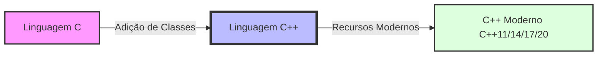

# Aula 01 - Introdução ao C++ 🚀

Bem-vindo ao curso de **Sistemas com C++**! Nesta primeira aula, vamos mergulhar na história e nos fundamentos de uma das linguagens mais poderosas e influentes do mundo.

---

## 📖 O que é C++?

O C++ é uma linguagem de programação de alto nível, mas que oferece recursos de baixo nível (manipulação de memória). Foi criada por **Bjarne Stroustrup** em 1979 no Bell Labs como uma extensão da linguagem C.

### ⏳ História e Evolução

Originalmente chamado de "C com Classes", o C++ evoluiu para suportar múltiplos paradigmas:
- **Programação Estruturada** (como no C)
- **Programação Orientada a Objetos** (Classes, Herança, Polimorfismo)
- **Programação Genérica** (Templates)

### 🔄 Diferenças entre C e C++



---

## 🛠️ Compiladores e Ambiente

Para transformar nosso código em um programa executável, precisamos de um **Compilador**.

- **GCC / G++**: O padrão no mundo Linux.
- **MinGW**: Uma versão do GCC para Windows.
- **MSVC**: O compilador do Visual Studio (Windows).

### ⚙️ Ciclo de Vida do Código

1. **Código Fonte** (`.cpp`, `.h`)
2. **Pré-processamento** (Trata `#include`, Macro)
3. **Compilação** (Gera código de máquina/objeto)
4. **Linkagem** (Une códigos objeto e bibliotecas)
5. **Executável** (`.exe` no Windows, binário no Linux)

---

## 💻 Meu Primeiro Programa: Hello World

Vamos ver a estrutura básica de um programa C++.

```cpp
#include <iostream> // Biblioteca de Entrada e Saída

int main() {
    // std::cout é usado para imprimir no console
    std::cout << "Olá, Mundo C++!" << std::endl;
    
    return 0; // Indica que o programa terminou com sucesso
}
```

### ⌨️ Compilando via Terminal

<div class="termy" markdown="1">
```bash
$ g++ hello.cpp -o hello
$ ./hello
Olá, Mundo C++!
```
</div>

---

## 🧠 Conceitos Importantes

!!! info "O que é um Namespace?"
    O `std::` antes do `cout` indica que ele pertence ao *Namespace* padrão (**Standard**). Isso evita conflitos de nomes em projetos grandes.

!!! warning "Atenção com a Compilação"
    Sempre use a flag `-o` para dar um nome ao seu executável, caso contrário ele se chamará `a.out` (Linux) ou `a.exe` (Windows) por padrão.

---

## 📝 Exercício de Fixação

1. **Instalação**: Configure o ambiente (MinGW no Windows ou G++ no Linux).
2. **Codificação**: Crie um programa que imprima seu nome e sua meta para este curso.
3. **Desafio**: Tente compilar usando a flag `-Wall` para ver se o compilador gera algum aviso (warning).

---

## 🚀 Mini-Projeto da Aula

**Sistema de Boas-Vindas Dinâmico**:
Crie um programa que utilize `std::cout` para exibir um menu artístico de boas-vindas ao seu próprio sistema. Use caracteres especiais e quebras de linha para formatar.