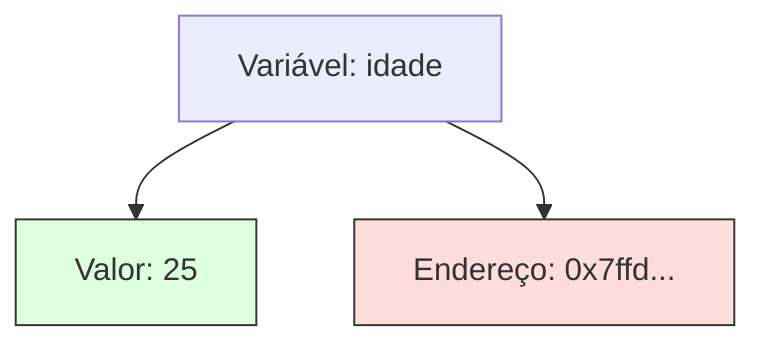

# Aula 07 - Ponteiros e Referências 👆

Nesta aula, desvendaremos um dos temas mais temidos e importantes do C++: a manipulação direta de memória.

---

## 🧠 Conceito de Memória

Toda variável que declaramos ocupa um espaço na memória RAM, identificado por um **endereço hexadecimal**.



---

## 📍 Ponteiros

Um **Ponteiro** é uma variável especial que armazena o **endereço de memória** de outra variável.

- `&` (Operador de Endereço): Retorna o endereço de uma variável.
- `*` (Operador de Desreferência): Acessa o valor no endereço armazenado pelo ponteiro.

```cpp
int x = 10;
int* ptr = &x; // ptr recebe o endereço de x

std::cout << "Endereço: " << ptr << std::endl;
std::cout << "Valor: " << *ptr << std::endl; // Acessa o 10
```

---

## 🔗 Referências

Uma **Referência** é um "apelido" para uma variável existente. Diferente do ponteiro, ela não pode ser nula e não pode ser alterada para apontar para outra variável após ser criada.

```cpp
int original = 50;
int &ref = original;

ref = 100; // Altera original para 100
```

---

## 🏗️ Introdução à Alocação Dinâmica

Normalmente, a memória é alocada na **Stack** (Pilha). Quando precisamos de blocos maiores ou controle total sobre a vida útil, usamos o **Heap** (Monte) com `new` e `delete`.

```cpp
int* p = new int; // Aloca memória no Heap
*p = 20;
delete p; // Libera a memória (Essencial para evitar Memory Leaks)
```

---

## 🧠 Dicas de Ouro

!!! info "Ponteiros para Funções"
    Você pode passar o endereço de uma função como parâmetro, permitindo que uma função chame outra dinamicamente (callback).

!!! warning "O Perigo do nullptr"
    Sempre inicialize seus ponteiros com `nullptr` se não tiver um endereço imediato. Tentar acessar um ponteiros "lixo" causará o famoso erro *Segmentation Fault*.

---

## 💻 Exemplo Prático: Manipulação via Ponteiro

```cpp
#include <iostream>

void zerar(int* p) {
    if (p != nullptr) {
        *p = 0; // Altera o valor no endereço apontado
    }
}

int main() {
    int valor = 100;
    std::cout << "Antes: " << valor << std::endl;
    
    zerar(&valor); // Passa o endereço de valor
    
    std::cout << "Depois: " << valor << std::endl;
    
    return 0;
}
```

---

## 📝 Exercício de Fixação

1. **Endereço**: Imprima o endereço de memória de uma variável `float` e de uma `double`. Qual a diferença de tamanho?
2. **Ponteiro**: Crie um ponteiro que aponte para um array e use aritmética de ponteiros para percorrer os elementos.
3. **Desafio**: Use `new` para criar um array dinâmico, peça o tamanho ao usuário, preencha-o e depois use `delete[]` para liberar a memória.

---

## 🚀 Mini-Projeto da Aula

**Gerenciador de Memória Manual**:
Crie um programa que permita ao usuário alocar dinamicamente um registro de notas. O usuário escolhe o tamanho, insere os dados e, ao final, o programa deve exibir os dados e garantir que a memória seja liberada corretamente.