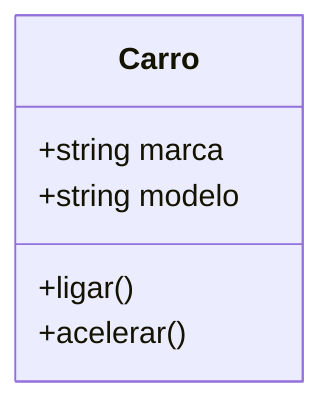

# Aula 09 - Conceitos de POO 🏢

Bem-vindo à **Programação Orientada a Objetos (POO)**. Nesta aula, mudaremos nossa forma de pensar: de "sequência de ações" para "interação entre objetos".

---

## 🧱 Classe vs Objeto

Uma **Classe** é o molde (blueprint). O **Objeto** é a instância real criada a partir desse molde.



---

## ⚙️ Membros da Classe

### Atributos (Dados)
São as características do objeto (ex: cor, tamanho, preço).

### Métodos (Comportamento)
São as funções que o objeto pode realizar (ex: andar, emitir som, calcular soma).

---

## 🛡️ Encapsulamento

É a técnica de esconder os detalhes internos de um objeto e expor apenas o necessário através de uma interface segura.

### Modificadores de Acesso:
- `public`: Acessível de qualquer lugar.
- `private`: Acessível apenas dentro da própria classe (Padrão para atributos).
- `protected`: Acessível pela classe e suas filhas (Herança).

---

## 💻 Exemplo Prático: Minha Primeira Classe

```cpp
#include <iostream>
#include <string>

class ContaBancaria {
private:
    std::string titular;
    double saldo;

public:
    // Método para configurar dados (Setter)
    void inicializar(std::string t, double s) {
        titular = t;
        saldo = s;
    }

    void depositar(double valor) {
        if (valor > 0) saldo += valor;
    }

    void exibirExtrato() {
        std::cout << "Titular: " << titular << " | Saldo: R$ " << saldo << std::endl;
    }
};

int main() {
    ContaBancaria minhaConta;
    minhaConta.inicializar("Ricardo", 1000.00);
    minhaConta.depositar(500.50);
    minhaConta.exibirExtrato();
    
    return 0;
}
```

---

## 🧠 Conceitos Chave

!!! info "Por que usar POO?"
    A POO facilita a manutenção do código, permite o reaproveitamento e torna o desenvolvimento de grandes sistemas muito mais organizado e intuitivo.

!!! warning "Abstração"
    Não tente modelar tudo! Foque apenas nos atributos e comportamentos que são relevantes para o seu problema atual.

---

## 📝 Exercício de Fixação

1. **Atributos**: Crie uma classe `Retangulo` com atributos privados `largura` e `altura`.
2. **Métodos**: Adicione métodos para calcular a `area()` e o `perimetro()` do retângulo.
3. **Desafio**: Crie uma classe `Aluno` que armazene nome e um array de 3 notas. Implemente um método que retorne se o aluno está aprovado.

---

## 🚀 Mini-Projeto da Aula

**Simulador de Personagem RPG**:
Crie uma classe `Guerreiro` com: Nome, Vida e Força. Implemente métodos para: `atacar(Guerreiro &alvo)` (que reduz a vida do alvo com base na força) e `exibirStatus()`. Simule uma batalha simples entre dois objetos guerreiros no `main`.