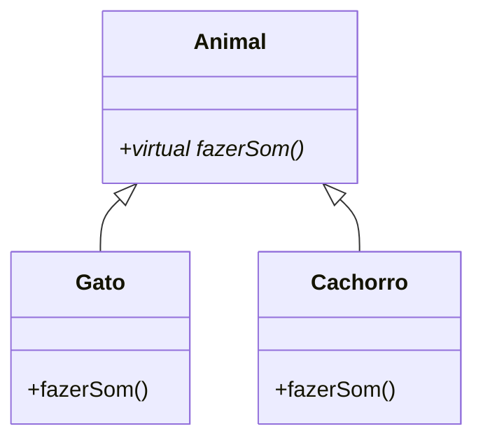

# Aula 11 - Herança e Polimorfismo 🌳

Nesta aula, aprenderemos como criar hierarquias de classes e como tratar diferentes objetos de forma genérica.

---

## 🧬 Herança

Permite que uma classe (Filha/Derivada) herde atributos e métodos de outra (Pai/Base).

```cpp
class Animal {
public:
    void comer() { std::cout << "Comendo..." << std::endl; }
};

class Cachorro : public Animal {
public:
    void latir() { std::cout << "Au Au!" << std::endl; }
};
```

---

## 🎭 Polimorfismo

O polimorfismo permite que uma função tenha comportamentos diferentes dependendo do objeto que a chama. Para isso, usamos **Funções Virtuais**.

### Funções Virtuais (`virtual`)
Diz ao compilador para procurar a implementação mais específica da função em tempo de execução.

```cpp
class Forma {
public:
    virtual void desenhar() { std::cout << "Desenhando forma genérica" << std::endl; }
};

class Circulo : public Forma {
public:
    void desenhar() override { std::cout << "Desenhando um círculo ○" << std::endl; }
};
```

---

## 🧊 Classes Abstratas

Uma classe é considerada abstrata quando possui pelo menos uma **Função Virtual Pura**. Ela serve apenas como molde e **não pode ser instanciada**.

```cpp
class Instrumento {
public:
    virtual void tocar() = 0; // Virtual Pura
};
```

---

## 🧠 Hierarquia Visual



---

## 💡 Por que usar `override`?

!!! tip "Segurança"
    Sempre use a palavra `override` ao sobrescrever um método. Isso garante que o compilador verifique se a função realmente existe na classe pai, evitando erros de digitação sutis.

!!! warning "Destrutores Virtuais"
    Se uma classe puder ser herdada, seu **destrutor deve ser virtual**. Caso contrário, ao deletar um objeto filho através de um ponteiro do pai, o destrutor do filho não será chamado, causando vazamento de memória.

---

## 💻 Exemplo Prático: Sistema de Pagamento

```cpp
#include <iostream>

class Pagamento {
public:
    virtual void processar(double valor) = 0;
    virtual ~Pagamento() {}
};

class Cartao : public Pagamento {
public:
    void processar(double valor) override {
        std::cout << "Processando R$ " << valor << " no cartão de crédito." << std::endl;
    }
};

class Pix : public Pagamento {
public:
    void processar(double valor) override {
        std::cout << "Gerando QR Code Pix para R$ " << valor << std::endl;
    }
};

int main() {
    Pagamento* p = new Pix();
    p->processar(150.00);
    
    delete p; // Chama o destrutor correto
    return 0;
}
```

---

## 📝 Exercício de Fixação

1. **Herança**: Crie uma classe `Pessoa` e uma subclasse `Professor` com o atributo `disciplina`.
2. **Polimorfismo**: Crie um array de ponteiros de `Animal` e preencha com objetos `Gato` e `Cachorro`. Percorra o array chamando `fazerSom()`.
3. **Desafio**: Implemente uma classe abstrata `Funcionario` e subclasses `Gerente` e `Vendedor`, cada uma com sua lógica de cálculo de salário.

---

## 🚀 Mini-Projeto da Aula

**Simulador de Zoológico**:
Crie uma estrutura onde diversos animais (Leão, Pássaro, Peixe) herdam de uma base comum. Cada um deve implementar seus métodos de `mover()` e `emitirSom()`. No `main`, use um loop para fazer todos os animais do zoológico "agirem" ao mesmo tempo.