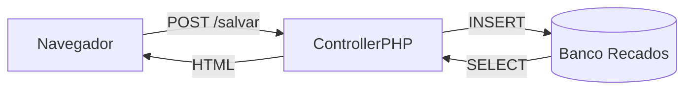

# Projeto 16 - Mural Fullstack (Milestone Final) 🏆

## O Desafio 🎯
Você chegou ao topo. É hora de conectar tudo. O projeto final é um "Mural de Recados Anônimos" (estilo Twitter antigo/Orkut).

**Objetivo**: Criar uma aplicação Web completa (Banco -> Back -> Front).

## Arquitetura (MVC)

## Requisitos Técnicos
1.  **Banco de Dados (MySQL)**:
    - Tabela `recados` (`id` INT AI, `texto` VARCHAR, `data_hora` DATETIME).
2.  **Backend (PHP/Laravel/Node)**:
    - Rota `GET /`: Lista recados.
    - Rota `POST /recado`: Salva novo recado.
3.  **Frontend (HTML/CSS)**:
    - Bootstrap para ficar bonito rápido.
    - Design responsivo (Mobile First - Aula 15!).

## Funcionalidades
1.  **Postar**: Escrever mensagem e enviar.
2.  **Feed**: Ver mensagens (Mais recentes no topo).
3.  **Sanitização**: Proteger contra XSS (não deixar usuário postar `<script>`).

## Dica de Ouro 🌟
Comece pelo Banco de Dados. Se o banco estiver errado, tudo dá errado.

## Entrega 📦
- Link do Repositório GitHub com código fonte e script SQL.