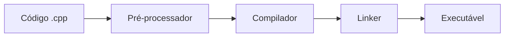

# Aula 01 - Introdução ao C++ 🚀

---

## O que é C++?
- Criado por **Bjarne Stroustrup** (1979) { .fragment }
- Extensão da linguagem **C** { .fragment }
- Linguagem de **Médio Nível** { .fragment }
- Alta performance e controle { .fragment }

--

## Por que C++ em 2026?
1. Sistemas Operacionais { .fragment }
2. Engines de Jogos (Unreal Engine) { .fragment }
3. Sistemas de Alta Performance (HFT) { .fragment }
4. Inteligência Artificial (Core do PyTorch/TF) { .fragment }

---

## O Ecossistema


---

## Hello World em C++
```cpp
#include <iostream>

int main() {
    std::cout << "Olá Mundo!" << std::endl;
    return 0;
}
```
- `#include`: Importa bibliotecas { .fragment }
- `main()`: Ponto de entrada { .fragment }
- `std::cout`: Fluxo de saída { .fragment }

---

## Compilação Manual
- Usamos o terminal: { .fragment }
```bash
g++ main.cpp -o programa
```
- `./programa` para executar { .fragment }

---

## História Resumida
- **1983**: Nome mudado para C++ { .fragment }
- **1998**: Primeiro padrão (C++98) { .fragment }
- **2011**: O Renascimento (C++11) { .fragment }
- **2023**: C++23 (Moderno e Seguro) { .fragment }

---

## Paradigmas Suportados
- Procedural { .fragment }
- Orientado a Objetos { .fragment }
- Genérico (Templates) { .fragment }
- Funcional (Lambdas) { .fragment }

---

## Instalando o Compilador
- **Windows**: MinGW-w64 ou MSVC { .fragment }
- **Linux**: GCC / Clang { .fragment }
- **Mac**: Xcode Command Line Tools { .fragment }

---

## Configurando o VS Code
1. Extensão C/C++ da Microsoft { .fragment }
2. Ferramentas CMake { .fragment }
3. Terminal integrado { .fragment }

---

## Estrutura de um Arquivo
```cpp
// Cabeçalhos (Headers)
#include <iostream>

// Espaço de nomes (opcional)
using namespace std;

// Funções
int main() {
   // Código aqui
   return 0;
}
```

---

## Comentários
- `//` para linha única { .fragment }
- `/* ... */` para blocos { .fragment }
- Use para documentar o "Porquê" { .fragment }

---

## Variáveis e Saída
```cpp
int idade = 25;
std::cout << "Idade: " << idade << std::endl;
```

---

## O que vamos aprender?
- Lógica estruturada { .fragment }
- Gestão de memória { .fragment }
- Orientação a Objetos profissional { .fragment }
- Padrões de projeto modernos { .fragment }

---

## Desafios do C++
- Curva de aprendizado { .fragment }
- Gestão manual de memória (C++ Antigo) { .fragment }
- Variedade de padrões { .fragment }

---

## A Solução: C++ Moderno
- Foco em **RAII** { .fragment }
- Smart Pointers { .fragment }
- Menos código, mais segurança { .fragment }

---

## Mercado de Trabalho
- Salários competitivos { .fragment }
- Vagas em Big Techs { .fragment }
- Essencial para sistemas críticos { .fragment }

---

## Dica de Estudo
- Pratique todos os dias { .fragment }
- Não tenha medo dos erros do compilador { .fragment }
- Leia mensagens de erro com atenção { .fragment }

---

## Materiais Complementares
- cppreference.com { .fragment }
- LearnCpp.com { .fragment }
- Documentação do curso { .fragment }

---

## Vamos Começar?
- Abra seu terminal { .fragment }
- Digite `g++ --version` { .fragment }
- Se aparecer o número da versão, você está pronto! { .fragment }

---

## Fim da Aula 01
- Próxima parada: Tipos de Dados e Variáveis!