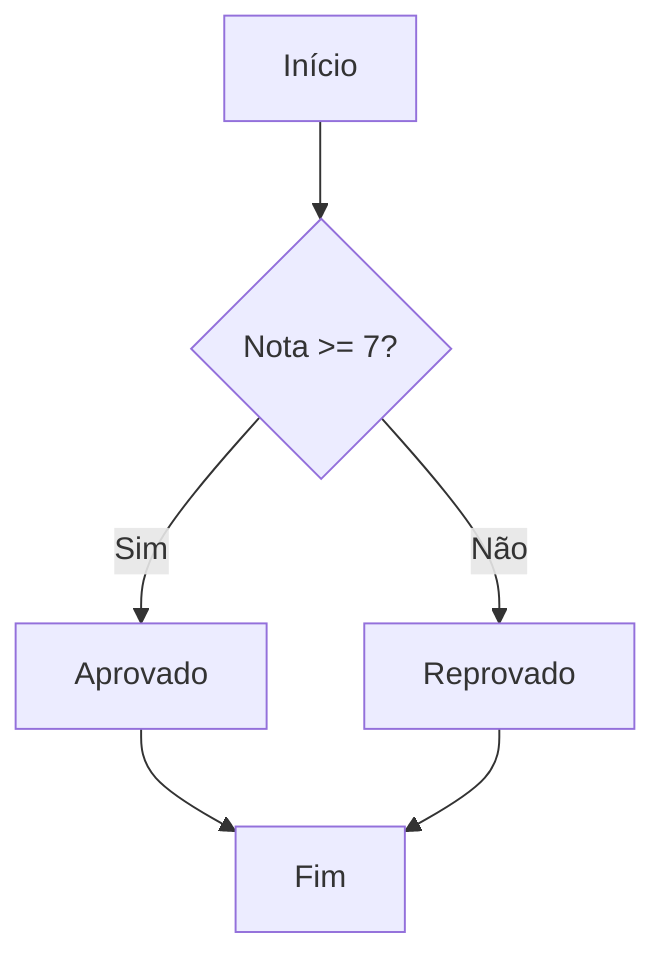

# Aula 04 - Estruturas de Controle 🚦

---

## O que são Estruturas de Controle?
- Determinam o fluxo de execução do programa. { .fragment }
- Permitem tomar decisões e repetir tarefas. { .fragment }

---

## Estrutura Condicional: if
```cpp
if (condicao) {
    // Executa se verdadeiro
}
```

---

## Condicional: if-else
```cpp
if (idade >= 18) {
    cout << "Maior de idade";
} else {
    cout << "Menor de idade";
}
```

---

## Condicional: else-if (Múltiplas Escolhas)
```cpp
if (nota >= 9) { ... }
else if (nota >= 7) { ... }
else { ... }
```

---

## O Comando switch
- Ideal para testar uma única variável contra vários valores constantes. { .fragment }
```cpp
switch (opcao) {
    case 1: cout << "Opção 1"; break;
    case 2: cout << "Opção 2"; break;
    default: cout << "Invalido";
}
```

---

## Importância do break no switch
- Sem o `break`, a execução "escorrega" para os próximos cases (fall-through). { .fragment }

---

## Laço de Repetição: while
- Executa enquanto a condição for verdadeira. { .fragment }
```cpp
while (condicao) {
    // Código
}
```

---

## Laço de Repetição: do-while
- Garante que o código seja executado **pelo menos uma vez**. { .fragment }
```cpp
do {
    // Executa primeiro, testa depois
} while (condicao);
```

---

## Laço de Repetição: for
- Ideal quando sabemos o número de iterações. { .fragment }
```cpp
for (inicialização; condição; incremento) {
    // Código
}
```

---

## Loop Infinito
- Acontece quando a condição de parada nunca é atingida. { .fragment }
- `while(true) { ... }` { .fragment }

---

## Comando break
- Interrompe o loop imediatamente e sai dele. { .fragment }

---

## Comando continue
- Pula o restante do código da iteração atual e vai para a próxima volta do loop. { .fragment }

---

## Loops Aninhados
- Um loop dentro do outro. { .fragment }
- Comum para matrizes e tabelas. { .fragment }
```cpp
for(int i=0; i<3; i++) {
    for(int j=0; j<3; j++) { ... }
}
```

---

## O Problema do "Código Espaguete"
- Evite muitos aninhamentos profundos. { .fragment }
- Prefira simplificar a lógica ou usar funções. { .fragment }

---

## Escopo de Variáveis em Loops
- Variáveis declaradas dentro do `for` ou `while` morrem ao fim dele. { .fragment }

---

## Fluxogramas e Lógica


---

## Tabela de Decisão
- Útil para planejar lógicas complexas com múltiplas variáveis. { .fragment }

---

## Prática: Menu Interativo
- Use `switch` e `do-while` para criar menus que só fecham quando o usuário pede. { .fragment }

---

## Prática: Validação de Entrada
- Use `while` para forçar o usuário a digitar um valor válido. { .fragment }

---

## Resumo da Aula
- `if` para decisões. { .fragment }
- `for` para contagens conhecidas. { .fragment }
- `while` para condições incertas. { .fragment }
- `switch` para menus. { .fragment }

---

## Curiosidade: Jump Statements
- `goto` existe no C++, mas é considerado má prática em 99% dos casos. { .fragment }

---

## Fim da Aula 04
- Próxima aula: Funções!