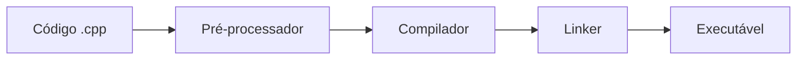

# Aula 01 - Introdução ao C++ 🚀

---

## O que é C++?
- Criado por **Bjarne Stroustrup** (1979) <!-- .element: class="fragment" -->
- Extensão da linguagem **C** <!-- .element: class="fragment" -->
- Linguagem de **Médio Nível** <!-- .element: class="fragment" -->
- Alta performance e controle <!-- .element: class="fragment" -->

--

## Por que C++ em 2026?
1. Sistemas Operacionais <!-- .element: class="fragment" -->
2. Engines de Jogos (Unreal Engine) <!-- .element: class="fragment" -->
3. Sistemas de Alta Performance (HFT) <!-- .element: class="fragment" -->
4. Inteligência Artificial (Core do PyTorch/TF) <!-- .element: class="fragment" -->

---

## O Ecossistema


---

## Hello World em C++
```cpp
#include <iostream>

int main() {
    std::cout << "Olá Mundo!" << std::endl;
    return 0;
}
```
- `#include`: Importa bibliotecas <!-- .element: class="fragment" -->
- `main()`: Ponto de entrada <!-- .element: class="fragment" -->
- `std::cout`: Fluxo de saída <!-- .element: class="fragment" -->

---

## Compilação Manual
- Usamos o terminal: <!-- .element: class="fragment" -->
```bash
g++ main.cpp -o programa
```
- `./programa` para executar <!-- .element: class="fragment" -->

---

## História Resumida
- **1983**: Nome mudado para C++ <!-- .element: class="fragment" -->
- **1998**: Primeiro padrão (C++98) <!-- .element: class="fragment" -->
- **2011**: O Renascimento (C++11) <!-- .element: class="fragment" -->
- **2023**: C++23 (Moderno e Seguro) <!-- .element: class="fragment" -->

---

## Paradigmas Suportados
- Procedural <!-- .element: class="fragment" -->
- Orientado a Objetos <!-- .element: class="fragment" -->
- Genérico (Templates) <!-- .element: class="fragment" -->
- Funcional (Lambdas) <!-- .element: class="fragment" -->

---

## Instalando o Compilador
- **Windows**: MinGW-w64 ou MSVC <!-- .element: class="fragment" -->
- **Linux**: GCC / Clang <!-- .element: class="fragment" -->
- **Mac**: Xcode Command Line Tools <!-- .element: class="fragment" -->

---

## Configurando o VS Code
1. Extensão C/C++ da Microsoft <!-- .element: class="fragment" -->
2. Ferramentas CMake <!-- .element: class="fragment" -->
3. Terminal integrado <!-- .element: class="fragment" -->

---

## Estrutura de um Arquivo
```cpp
// Cabeçalhos (Headers)
#include <iostream>

// Espaço de nomes (opcional)
using namespace std;

// Funções
int main() {
   // Código aqui
   return 0;
}
```

---

## Comentários
- `//` para linha única <!-- .element: class="fragment" -->
- `/* ... */` para blocos <!-- .element: class="fragment" -->
- Use para documentar o "Porquê" <!-- .element: class="fragment" -->

---

## Variáveis e Saída
```cpp
int idade = 25;
std::cout << "Idade: " << idade << std::endl;
```

---

## O que vamos aprender?
- Lógica estruturada <!-- .element: class="fragment" -->
- Gestão de memória <!-- .element: class="fragment" -->
- Orientação a Objetos profissional <!-- .element: class="fragment" -->
- Padrões de projeto modernos <!-- .element: class="fragment" -->

---

## Desafios do C++
- Curva de aprendizado <!-- .element: class="fragment" -->
- Gestão manual de memória (C++ Antigo) <!-- .element: class="fragment" -->
- Variedade de padrões <!-- .element: class="fragment" -->

---

## A Solução: C++ Moderno
- Foco em **RAII** <!-- .element: class="fragment" -->
- Smart Pointers <!-- .element: class="fragment" -->
- Menos código, mais segurança <!-- .element: class="fragment" -->

---

## Mercado de Trabalho
- Salários competitivos <!-- .element: class="fragment" -->
- Vagas em Big Techs <!-- .element: class="fragment" -->
- Essencial para sistemas críticos <!-- .element: class="fragment" -->

---

## Dica de Estudo
- Pratique todos os dias <!-- .element: class="fragment" -->
- Não tenha medo dos erros do compilador <!-- .element: class="fragment" -->
- Leia mensagens de erro com atenção <!-- .element: class="fragment" -->

---

## Materiais Complementares
- cppreference.com <!-- .element: class="fragment" -->
- LearnCpp.com <!-- .element: class="fragment" -->
- Documentação do curso <!-- .element: class="fragment" -->

---

## Vamos Começar?
- Abra seu terminal <!-- .element: class="fragment" -->
- Digite `g++ --version` <!-- .element: class="fragment" -->
- Se aparecer o número da versão, você está pronto! <!-- .element: class="fragment" -->

---

## Fim da Aula 01
- Próxima parada: Tipos de Dados e Variáveis!