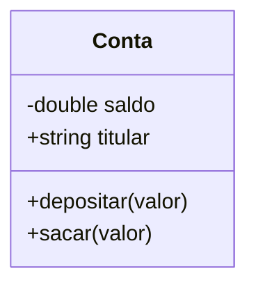

# Aula 09 - Conceitos de POO 🏢

---

## O que é POO?
- Programação Orientada a Objetos. <!-- .element: class="fragment" -->
- Paradigma que aproxima o código de conceitos do mundo real. <!-- .element: class="fragment" -->

---

## Os 4 Pilares da POO
1. Encapsulamento <!-- .element: class="fragment" -->
2. Abstração <!-- .element: class="fragment" -->
3. Herança <!-- .element: class="fragment" -->
4. Polimorfismo <!-- .element: class="fragment" -->

---

## Classe vs Objeto
- **Classe**: A planta do arquiteto (Molde). <!-- .element: class="fragment" -->
- **Objeto**: A casa construída (Instância). <!-- .element: class="fragment" -->

---

## Definindo uma Classe
```cpp
class ContaBancaria {
public:
    string titular;
    double saldo;

    void depositar(double v) { saldo += v; }
};
```

---

## Modificadores de Acesso
- `public`: Acesso universal. <!-- .element: class="fragment" -->
- `private`: Acesso restrito à própria classe. <!-- .element: class="fragment" -->
- `protected`: Própria classe e herdeiros. <!-- .element: class="fragment" -->

---

## O Poder do Encapsulamento
- Não deixe que qualquer um mude seu saldo diretamente! <!-- .element: class="fragment" -->
- Torne os atributos **privados** e use métodos para alterá-los. <!-- .element: class="fragment" -->

---

## Métodos Getters e Setters
```cpp
void setSaldo(double v) { if (v > 0) saldo = v; }
double getSaldo() { return saldo; }
```

---

## Abstração
- Focar no essencial e ignorar detalhes irrelevantes. <!-- .element: class="fragment" -->
- Uma classe "Carro" no sistema de mecânica foca em peças; no sistema de trânsito foca em placa/velocidade. <!-- .element: class="fragment" -->

---

## Membros Estáticos (static)
- Atributos ou métodos que pertencem à **classe**, não ao objeto. <!-- .element: class="fragment" -->
- Compartilhados por todas as instâncias. <!-- .element: class="fragment" -->

---

## Ponteiro implicitando: the `this` pointer
- Todo objeto possui um ponteiro `this` que aponta para si mesmo. <!-- .element: class="fragment" -->
- Útil para distinguir parâmetros de atributos com mesmo nome. <!-- .element: class="fragment" -->

---

## Diagrama de Classe (UML)


---

## Design de Classes
- Pense nas responsabilidades: "O que esta classe **sabe** e o que ela **faz**?" <!-- .element: class="fragment" -->

---

## Interação entre Objetos
- Objetos podem ser passados como parâmetros para outros objetos. <!-- .element: class="fragment" -->
- Ex: Uma classe `Banco` que contém uma lista de objetos `Conta`. <!-- .element: class="fragment" -->

---

## Getters e Setters automáticos?
- Diferente de outras linguagens, no C++ você deve escrevê-los ou usar snippets da IDE. <!-- .element: class="fragment" -->

---

## Composição (has-a)
- Uma classe que contém outra como atributo. <!-- .element: class="fragment" -->
- Ex: `Carro` tem um objeto `Motor`. <!-- .element: class="fragment" -->

---

## Delegação
- Quando um objeto pede para outro realizar uma tarefa. <!-- .element: class="fragment" -->

---

## Boas Práticas: Interface vs Implementação
- Mantenha a interface (pública) o mais simples possível. <!-- .element: class="fragment" -->
- Esconda a complexidade (privada). <!-- .element: class="fragment" -->

---

## Por que C++ é bom para POO?
- Controle total sobre o ciclo de vida do objeto. <!-- .element: class="fragment" -->
- Sem overhead obrigatório de Garbage Collection. <!-- .element: class="fragment" -->

---

## Atributos Constantes em Classes
- Atributos que nunca mudam após criados (ex: ID secreto). <!-- .element: class="fragment" -->

---

## Métodos Constantes
- `void exibir() const;` <!-- .element: class="fragment" -->
- Garante que o método não alterará nenhum atributo do objeto. <!-- .element: class="fragment" -->

---

## Resumo da Aula
- POO organiza sistemas complexos. <!-- .element: class="fragment" -->
- Use classes para criar seus próprios tipos de dados inteligentes. <!-- .element: class="fragment" -->
- Encapsule para proteger sua lógica. <!-- .element: class="fragment" -->

---

## Fim da Aula 09
- Próxima aula: Construtores e Destrutores!